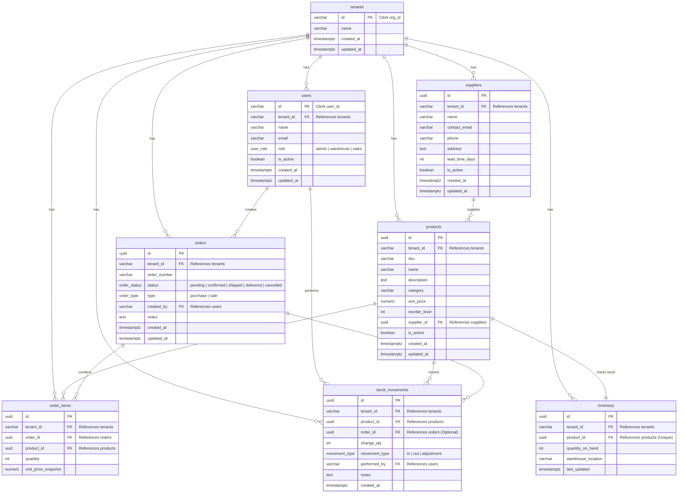

# Enterprise Inventory Management System (EMS)

A production-grade **multi-tenant** SaaS inventory management platform built with React 18, Node.js/Express, PostgreSQL, and **Clerk** for authentication and organization management.

## Tech Stack

| Layer       | Technology                                          |
|-------------|-----------------------------------------------------|
| Frontend    | React 18, Vite, Tailwind CSS, React Query, Recharts |
| Backend     | Node.js, Express.js (OOP architecture)              |
| Database    | PostgreSQL 16 (normalised schema, transactions)     |
| Auth        | Clerk (session tokens, organizations, RBAC)         |
| Deployment  | Docker Compose, Nginx                               |

## Architecture

```
Client (React + Clerk)
  └── Axios (Clerk session token interceptor)
        └── Express Router
              └── ClerkExpressRequireAuth middleware
                    └── Tenant auto-provisioning
                          └── requireRole middleware (RBAC)
                                └── Controller (HTTP adapter)
                                      └── Service (business logic + transactions)
                                            └── Repository (raw SQL, pg pool)
                                                  └── PostgreSQL
```

## Multi-Tenant Data Isolation

Every database table is scoped by `tenant_id` (Clerk Organization ID). Tenant isolation is enforced at **three layers**:

1. **Middleware Layer** — `ClerkExpressRequireAuth` validates the Clerk session token and extracts `req.auth.orgId`. If no organization is selected, the request is rejected with `403`.
2. **Repository Layer** — Every SQL query includes a `WHERE tenant_id = $X` clause. No cross-tenant data leakage is possible.
3. **Auto-Provisioning** — On first request, the middleware automatically creates the tenant and user records in our database.

## Database Schema

| Table            | Purpose                                     |
|------------------|---------------------------------------------|
| tenants          | Clerk Organizations (multi-tenant root)     |
| users            | Clerk Users with role assignments           |
| suppliers        | Vendor master data (tenant-scoped)          |
| products         | Product catalogue with reorder levels       |
| inventory        | Live stock quantities per product           |
| orders           | Purchase and sale order headers             |
| order_items      | Line items with price snapshots             |
| stock_movements  | Full audit trail of all stock changes       |

### Entity Relationship Diagram




## Key Technical Features

### Atomic Stock Deduction
When a sale order is confirmed, all three operations run in a single `BEGIN/COMMIT` transaction:
1. Validate sufficient stock
2. `UPDATE inventory SET quantity_on_hand = quantity_on_hand - X`
3. `INSERT INTO stock_movements`

Any failure triggers `ROLLBACK` — no partial state ever persists.

### Role-Based Access Control
Three roles with route-level enforcement:
- **Admin**: full access to all endpoints
- **Warehouse**: stock adjustments, inventory reads
- **Sales**: create/view orders, read products

### Price Snapshot
`order_items.unit_price_snapshot` captures the product price at order creation time. Historical order totals remain accurate independent of future price changes — mirrors real ERP design (SAP/Oracle).

### Clerk Authentication
- Users sign in via Clerk's hosted UI (email/password, social, MFA)
- Organization switching is built into the sidebar via `<OrganizationSwitcher />`
- Session tokens are automatically attached to API requests via an Axios interceptor
- Backend verifies tokens with `@clerk/clerk-sdk-node`

## Quick Start

### Prerequisites

1. **Node.js 20+** and **PostgreSQL 16**
2. A **Clerk** account — [dashboard.clerk.com](https://dashboard.clerk.com)
   - Create an application
   - Enable the "Organizations" feature
   - Copy your **Publishable Key** and **Secret Key**

### With Docker Compose (recommended)

```bash
git clone <repo>
cd ems

# Set Clerk keys in docker-compose.yml or .env files
docker compose up -d
```

Then seed the database with demo data:
```bash
docker exec ems_backend node seed.js
```

App available at: `http://localhost:5173`

### Local Development

```bash
# Database setup
psql -U postgres -c "CREATE DATABASE ems_db;"
psql -U postgres -d ems_db -f backend/schema.sql

# Backend
cd backend
cp .env.example .env   # fill in Clerk keys and DB credentials
npm install
npm run seed           # seed demo data
npm run dev            # http://localhost:5000

# Frontend (new terminal)
cd frontend
cp .env.example .env   # fill in Clerk publishable key
npm install
npm run dev            # http://localhost:5173
```

### Environment Variables

#### Backend (`.env`)
```env
PORT=5000
DB_HOST=localhost
DB_PORT=5432
DB_NAME=ems_db
DB_USER=postgres
DB_PASSWORD=your_password
CLERK_SECRET_KEY=sk_test_...
CLERK_PUBLISHABLE_KEY=pk_test_...
CORS_ORIGIN=http://localhost:5173
```

#### Frontend (`.env`)
```env
VITE_CLERK_PUBLISHABLE_KEY=pk_test_...
```

## Getting Started After Setup

1. Visit `http://localhost:5173` → You'll be redirected to Clerk's sign-in page
2. Create an account and then create your first **Organization** (this is your enterprise/tenant)
3. Start adding products, suppliers, and managing inventory!

## API Reference

### Users
| Method | Endpoint              | Access | Description              |
|--------|-----------------------|--------|--------------------------|
| GET    | /api/users/me         | Auth   | Current user profile     |
| GET    | /api/users            | Admin  | List org users           |
| GET    | /api/users/:id        | Admin  | Single user              |
| PATCH  | /api/users/:id/role   | Admin  | Update user role         |
| PATCH  | /api/users/:id/active | Admin  | Activate/deactivate user |

### Products
| Method | Endpoint                  | Access | Description              |
|--------|---------------------------|--------|--------------------------|
| GET    | /api/products             | Auth   | List (search/filter/low) |
| GET    | /api/products/categories  | Auth   | Distinct categories      |
| GET    | /api/products/:id         | Auth   | Single product           |
| POST   | /api/products             | Admin  | Create + init inventory  |
| PUT    | /api/products/:id         | Admin  | Update product           |
| DELETE | /api/products/:id         | Admin  | Soft delete              |

### Suppliers
| Method | Endpoint                     | Access | Description          |
|--------|------------------------------|--------|----------------------|
| GET    | /api/suppliers               | Auth   | List suppliers       |
| GET    | /api/suppliers/:id           | Auth   | Single supplier      |
| GET    | /api/suppliers/:id/products  | Auth   | Supplier's products  |
| POST   | /api/suppliers               | Admin  | Create supplier      |
| PUT    | /api/suppliers/:id           | Admin  | Update supplier      |
| DELETE | /api/suppliers/:id           | Admin  | Soft delete          |

### Inventory
| Method | Endpoint                            | Access           | Description       |
|--------|-------------------------------------|------------------|-------------------|
| GET    | /api/inventory                      | Auth             | All stock levels  |
| GET    | /api/inventory/low-stock            | Auth             | Below reorder     |
| GET    | /api/inventory/:productId/movements | Auth             | Movement history  |
| POST   | /api/inventory/adjust               | Warehouse, Admin | Manual adjustment |

### Orders
| Method | Endpoint                | Access | Description              |
|--------|-------------------------|--------|--------------------------|
| GET    | /api/orders             | Auth   | List (filter status/type)|
| GET    | /api/orders/:id         | Auth   | Order + line items       |
| POST   | /api/orders             | Auth   | Create (pending state)   |
| POST   | /api/orders/:id/confirm | Auth   | Atomic stock operation   |
| PATCH  | /api/orders/:id/status  | Auth   | Update status            |
| DELETE | /api/orders/:id         | Admin  | Delete pending/cancelled |

### Analytics
| Method | Endpoint                      | Access | Description         |
|--------|-------------------------------|--------|---------------------|
| GET    | /api/analytics/kpis           | Auth   | Dashboard KPIs      |
| GET    | /api/analytics/top-products   | Auth   | Top sellers         |
| GET    | /api/analytics/stock-value    | Auth   | Value by category   |
| GET    | /api/analytics/movements      | Auth   | Movement trend      |
| GET    | /api/analytics/order-trend    | Auth   | Order volume trend  |
| GET    | /api/analytics/reorder-report | Auth   | Full reorder report |

## Project Structure

```
ems/
├── backend/
│   ├── src/
│   │   ├── config/         db.js
│   │   ├── middleware/      auth.js (Clerk), role.js, error.js
│   │   ├── modules/
│   │   │   ├── users/       router, controller, repository
│   │   │   ├── products/    router, controller, service, repository
│   │   │   ├── suppliers/   router, controller, repository
│   │   │   ├── inventory/   router, controller, service, repository
│   │   │   ├── orders/      router, controller, service, repository
│   │   │   └── analytics/   router, controller, service
│   │   └── utils/           response.js
│   ├── schema.sql
│   ├── seed.js
│   ├── init-prod.js
│   └── Dockerfile
├── frontend/
│   ├── src/
│   │   ├── api/             axios.js (Clerk token interceptor)
│   │   ├── contexts/        AuthContext.jsx (Clerk wrapper)
│   │   ├── routes/          ProtectedRoute.jsx
│   │   ├── components/
│   │   │   ├── layout/      Layout.jsx, Sidebar.jsx (OrganizationSwitcher)
│   │   │   └── ui/          Modal, KpiCard, Badge, etc.
│   │   └── pages/           Dashboard, Products, Inventory,
│   │                        Orders, Suppliers, Analytics, Users
│   ├── nginx.conf
│   └── Dockerfile
└── docker-compose.yml
```
